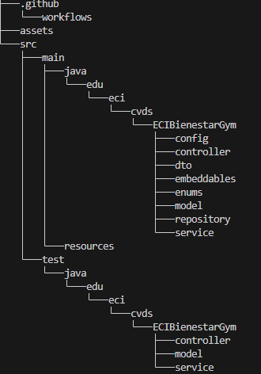
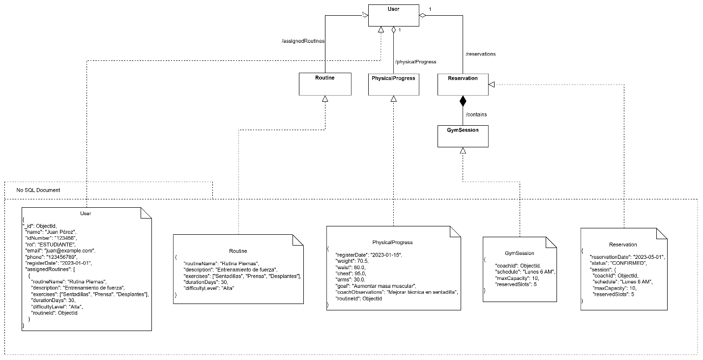
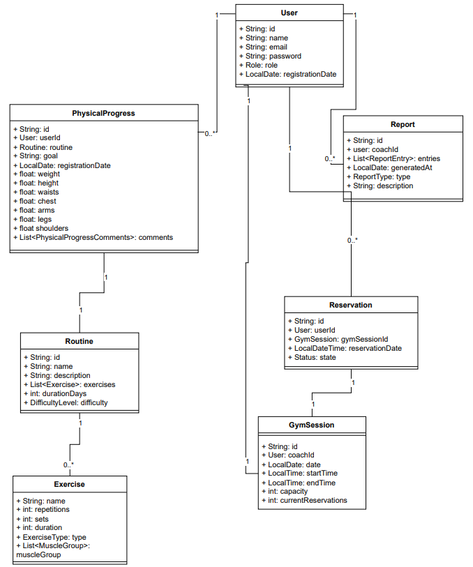
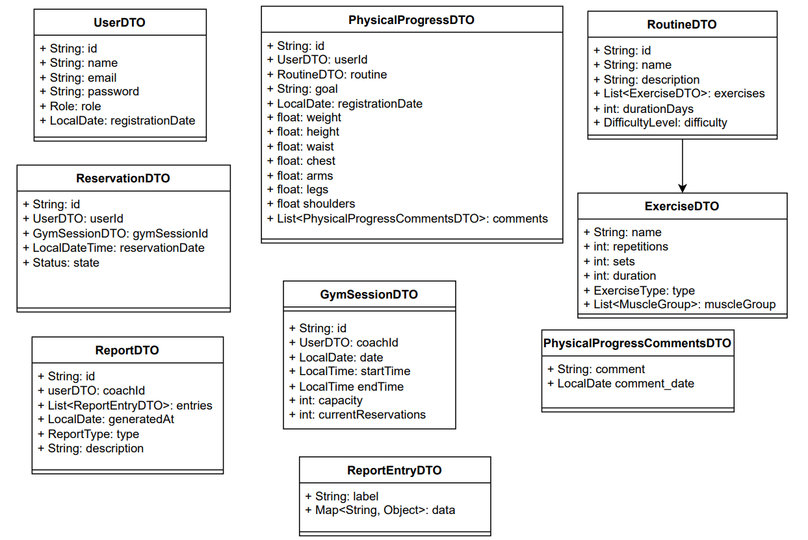
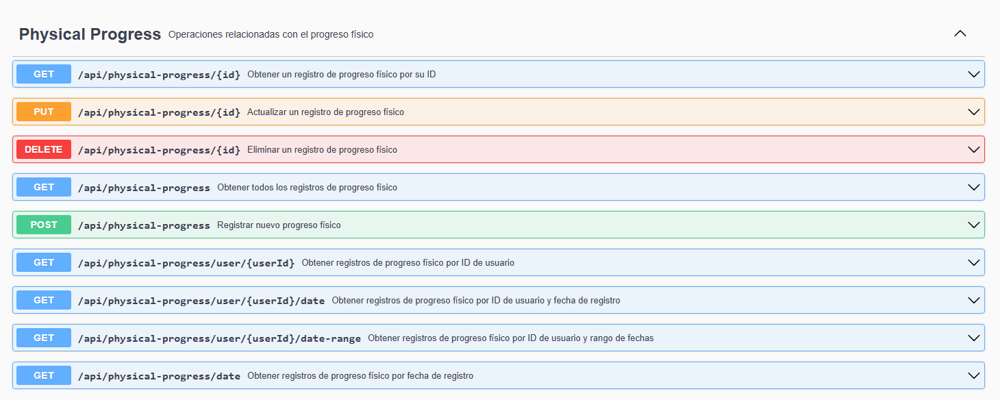
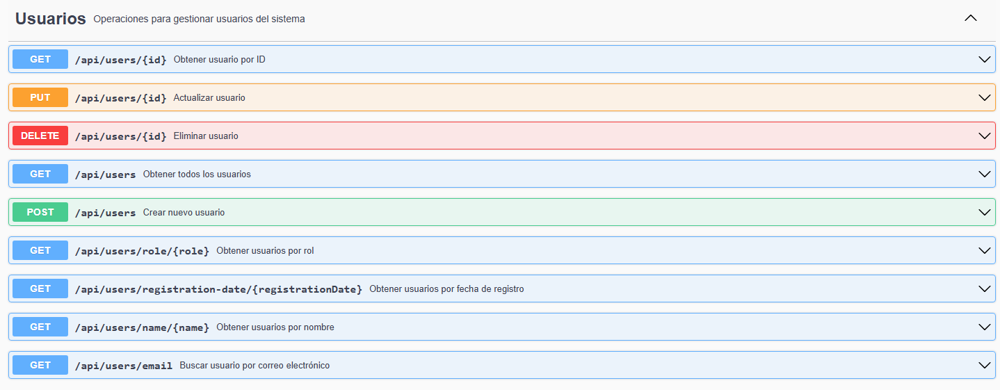
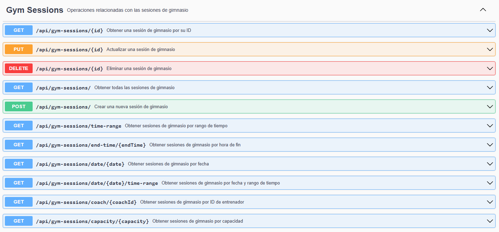
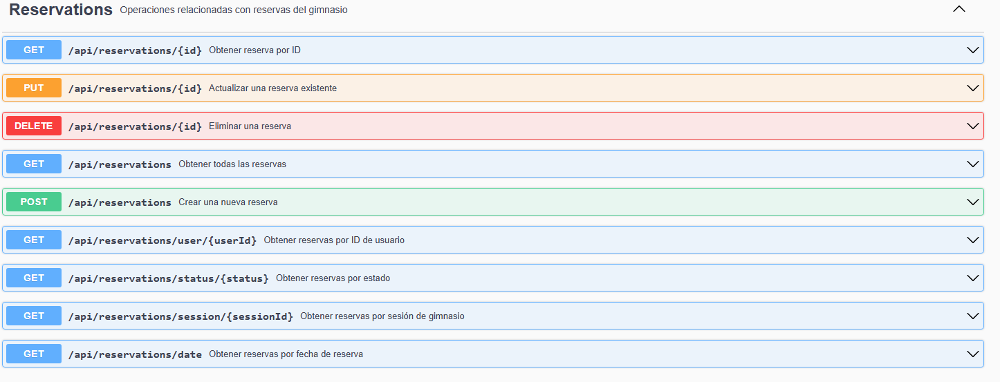
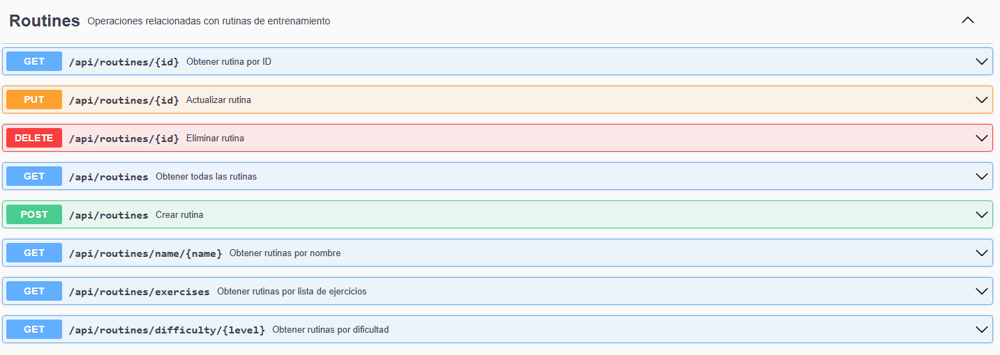
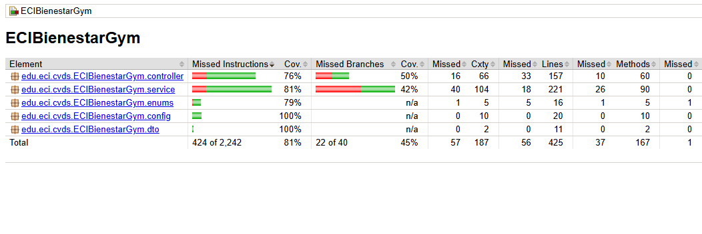

# ECIBienestarGymService

Gym management microservice for the ECI-Wellness platform. She manages Gym Sessions, Reservations, Physical Routines, Physical Progress and Trainer Reports for wellness services at the Julio Garavito Colombian School of Engineering.

## Overview

This module allows students to book training sessions, design their personalized routines, and track their physical progress in detail.

With the accompaniment of a coach, users receive feedback on their progress, get recommendations tailored to their goals, and access sessions structured according to their needs.

In addition, coaches can generate individual and group performance reports, as well as reports on sessions, manage routines, and optimize the training experience.

## Technologies

Java 17

Apache Maven 3.9.x.

SpringBoot 3.3.4.

Maven

Lombok

JaCoCo

SonarCloud

AzureDevops.

MongoDB.

##  Project Structure

## How to run

1: Clone this repository

git clone https://github.com/ECIBienestar/netherita-gymnasium-service.git

_cd ECIBienestar_

2: Run Project with mvn 

mvn clean install

3: Run with SpringBoot:

Go to EciBienestarGymApplication

type _mvn spring-boot:run_ in terminal

## Diagrams

### Data:

### Clases

### DTO

### Components

### Sequence

Situation: A student records his current physical measurements.

Situation: The student or coach consults the physical history.

Situation: A coach assigns a routine to a student.

Situation: The student reserves an available space in the gym.

Situation: An administrator requests a physical progress report for each user.

## Functionalities

The functionalities are distributed across different controllers with their respective endpoints.

## Endpoints (Swagger):

Swagger documentation of the main endpoints:

https://netherita-gymnasium-service-d8hvgjameybudsh3.canadacentral-01.azurewebsites.net/swagger-ui/index.html

## Endpoints (Functionalities):

### GymSessionController:

| **Endpoint** | **Description** | **Input** | **Output** |
|:-------------|:----------------|:----------|:-----------|
| `GET /api/gym-sessions` | Retrieve all gym sessions | - | All sessions |
| `GET /api/gym-sessions/{id}` | Retrieve a gym session by ID | id | Session by ID |
| `GET /api/gym-sessions/coach/{coachId}` | Retrieve sessions by coach ID | coachId | Sessions by coach |
| `GET /api/gym-sessions/capacity/{capacity}` | Retrieve sessions by capacity | capacity | Filtered sessions |
| `GET /api/gym-sessions/date/{date}` | Retrieve sessions by date | date | Sessions by date |
| `GET /api/gym-sessions/date/{date}/time-range` | Retrieve sessions by date and time range | date | Sessions by date and time range |
| `GET /api/gym-sessions/end-time/{endTime}` | Retrieve sessions by end time | endTime | Sessions by end time |
| `GET /api/gym-sessions/time-range` | Retrieve sessions within a time range | - | Sessions by time range |
| `POST /api/gym-sessions` | Create a new gym session | GymSession | Created session |
| `PUT /api/gym-sessions/{id}` | Update a gym session | id, GymSession | Updated session |
| `DELETE /api/gym-sessions/{id}` | Delete a gym session | id | Deleted status |

### PhysicalProgressController:

| **Endpoint** | **Description** | **Input** | **Output** |
|:-------------|:----------------|:----------|:-----------|
| `GET /api/physical-progress` | Retrieve all physical progress records | - | All progress records |
| `GET /api/physical-progress/{id}` | Retrieve a progress record by ID | id | Progress by ID |
| `GET /api/physical-progress/user/{userId}` | Retrieve progress by user ID | userId | User's progress |
| `GET /api/physical-progress/user/{userId}/date` | Retrieve progress by user ID and date | userId, date | Progress by user and date |
| `GET /api/physical-progress/user/{userId}/date-range` | Retrieve progress by user ID and date range | userId, date range | Progress by range |
| `GET /api/physical-progress/date` | Retrieve progress by date | date | Progress by date |
| `POST /api/physical-progress` | Create a new progress record | PhysicalProgress | Created progress |
| `PUT /api/physical-progress/{id}` | Update a progress record | id, PhysicalProgress | Updated progress |
| `DELETE /api/physical-progress/{id}` | Delete a progress record | id | Deleted status |

### UserController:

| **Endpoint** | **Description** | **Input** | **Output** |
|:-------------|:----------------|:----------|:-----------|
| `GET /api/users` | Retrieve all users | - | All users |
| `GET /api/users/{id}` | Retrieve a user by ID | id | User by ID |
| `GET /api/users/name/{name}` | Retrieve users by name | name | Users by name |
| `GET /api/users/email` | Retrieve user by email | email | User by email |
| `GET /api/users/role/{role}` | Retrieve users by role | role | Users by role |
| `GET /api/users/registration-date/{registrationDate}` | Retrieve users by registration date | registrationDate | Users by date |
| `POST /api/users` | Create a new user | User | Created user |
| `PUT /api/users/{id}` | Update a user | id, User | Updated user |
| `DELETE /api/users/{id}` | Delete a user | id | Deleted status |

### ReservationController:

| **Endpoint** | **Description** | **Input** | **Output** |
|:-------------|:----------------|:----------|:-----------|
| `GET /api/reservations` | Retrieve all reservations | - | All reservations |
| `GET /api/reservations/{id}` | Retrieve a reservation by ID | id | Reservation by ID |
| `GET /api/reservations/user/{userId}` | Retrieve reservations by user ID | userId | Reservations by user |
| `GET /api/reservations/session/{sessionId}` | Retrieve reservations by session ID | sessionId | Reservations by session |
| `GET /api/reservations/date` | Retrieve reservations by date | date | Reservations by date |
| `GET /api/reservations/status/{status}` | Retrieve reservations by status | status | Reservations by status |
| `POST /api/reservations` | Create a new reservation | Reservation | Created reservation |
| `PUT /api/reservations/{id}` | Update a reservation | id, Reservation | Updated reservation |
| `DELETE /api/reservations/{id}` | Delete a reservation | id | Deleted status |

### ReportController:

| **Endpoint** | **Description** | **Input** | **Output** |
|:-------------|:----------------|:----------|:-----------|
| `GET /api/reports` | Retrieve all reports | - | All reports |
| `GET /api/reports/{id}` | Retrieve a report by ID | id | Report by ID |
| `GET /api/reports/coach/{coachId}` | Retrieve reports by coach ID | coachId | Reports by coach |
| `GET /api/reports/type` | Retrieve reports by type | type | Reports by type |
| `GET /api/reports/date` | Retrieve reports by generation date | date | Reports by date |
| `POST /api/reports` | Create a new report | Report | Created report |
| `PUT /api/reports/{id}` | Update a report | id, Report | Updated report |
| `DELETE /api/reports/{id}` | Delete a report | id | Deleted status |

### RoutineController:

| **Endpoint** | **Description** | **Input** | **Output** |
|:-------------|:----------------|:----------|:-----------|
| `GET /api/routines` | Retrieve all routines | - | All routines |
| `GET /api/routines/{id}` | Retrieve a routine by ID | id | Routine by ID |
| `GET /api/routines/name/{name}` | Retrieve routines by name | name | Routines by name |
| `GET /api/routines/difficulty/{level}` | Retrieve routines by difficulty | level | Routines by level |
| `GET /api/routines/exercises` | Retrieve routines by exercise list | exercises | Routines with exercise |
| `POST /api/routines` | Create a new routine | Routine | Created routine |
| `PUT /api/routines/{id}` | Update a routine | id, Routine | Updated routine |
| `DELETE /api/routines/{id}` | Delete a routine | id | Deleted status |

## Running Tests

How tu run Test

Open a terminal and type _mvn test_

## CI/CD

This project uses GitHub Actions to automate building, testing, and deployment:

Staging Pipeline: It is used when there is a commit on the develop branch or any branch derived from it, it is deployed in the Staging environment.

Link: http://netherita-gymnasium-service-d8hvgjameybudsh3.canadacentral-01.azurewebsites.net/

Production Pipeline: It is used when there is a commit on the main branch, it is deployed in the Production environment

Link: http://netherita-gymnasium-service-test-gcdue7cad9btb3eg.canadacentral-01.azurewebsites.net

Build: Compiles the application and creates the JAR package

Test: Runs unit tests and generates code coverage reports

Deploy: Deploys the application to the AWS environment

Configuration files are located in the .github/workflows/ directory.

 ## Test coverage

 

## Future Improvements

Integrate the project with JWT.

Integrate the service with the authentication module to receive a token and validate it.

Integrate the service with the ECIBienestar frontend to make HTTP requests to this service.

Increase unit test coverage.

Edit the endpoint path to increase security.

## Authors

* **Andrés Felipe Calderón Ramirez** - [andrescalderonr](https://github.com/andrescalderonr)
* **Natalia Espitia Espinel** - [Natalia-Espitia](https://github.com/Natalia-Espitia)
* **Jesus Alberto Jauregui Conde** - [JesusJC15](https://github.com/JesusJC15)
* **Santiago Hurtado Martínez** - [SantiagoHM20](https://github.com/SantiagoHM20)

