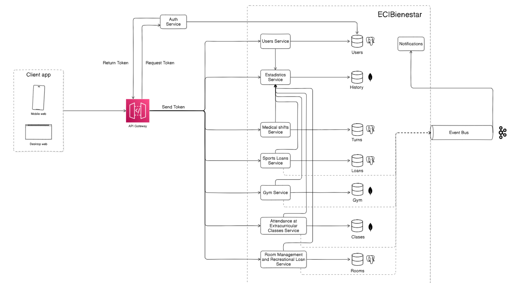

# ECIBienestarGymService

Gym management microservice for the ECIBienestar platform. She manages Gym Sessions, Reservations, Physical Routines, Physical Progress and Trainer Reports for wellness services at the Julio Garavito Colombian School of Engineering.

## Overview

This module allows students to book training sessions, design their personalized routines, and track their physical progress in detail.

With the accompaniment of a coach, users receive feedback on their progress, get recommendations tailored to their goals, and access sessions structured according to their needs.

In addition, coaches can generate individual and group performance reports, as well as reports on sessions, manage routines, and optimize the training experience.

[Requirements document](https://pruebacorreoescuelaingeduco-my.sharepoint.com/:w:/g/personal/natalia_espitia-e_mail_escuelaing_edu_co/EX6-qkp0pjRIqnNsfk-fmf4B9goEp3F88Bhoo5ZOZSjhCQ?e=9uvX4f)

## Interaction with other modules

The module operates as an independent microservice, orchestrated within a microservices-based architecture and exposed through an API Gateway that manages authentication and request routing.

General Interaction Flow:

    -Client (Web/Mobile): Sends requests for medical shifts to the API Gateway.

API Gateway:

    -Obtains a JWT token from the Auth Service.

    -Validates the token and routes the request to the corresponding microservice.

Medical Shifts Service:

    -Verifies the user and their roles through the Users Service.

    -Processes the request, records the information in its database, and emits events to the Event Bus.

Statistics Service:

    -Consumes generated events to generate historical reports and care statistics.

| Service           | Description                                      |
|-------------------|--------------------------------------------------|
| Auth Service      | Authentication and JWT token issuance            |
| API Gateway       | Routing and access control                        |
| Users Service     | User query and validation                         |
| Statistics Service| Historical record and report generation          |
| Event Bus         | Asynchronous event middleware (Kafka + Cloud Bus)|

### Microservices diagram

## Technologies

Java 17

Apache Maven 3.9.x.

SpringBoot 3.3.4.

Maven

Lombok

JaCoCo

SonarCloud

AzureDevops.

MongoDB.

##  Project Structure

### Architectural Style

[Architecture Document](https://pruebacorreoescuelaingeduco-my.sharepoint.com/:w:/r/personal/jesus_jauregui-c_mail_escuelaing_edu_co/_layouts/15/Doc.aspx?sourcedoc=%7BAD957616-FA57-4AB0-9ECC-028873C057AF%7D&)

## How to run

1: Clone this repository

git clone https://github.com/ECIBienestar/netherita-gymnasium-service.git

_cd ECIBienestar_

2: Run Project with mvn 

mvn clean install

3: Run with SpringBoot:

Go to EciBienestarGymApplication

type _mvn spring-boot:run_ in terminal
## Diagrams

### Data

This diagram shows the relationships between key entities: User, Routine, PhysicalProgress, GymSession, and Reservation. It includes example JSON structures to illustrate the stored data, such as user profiles, assigned routines, progress tracking, and session reservations.

### Classes

This diagram represents the class structure of the system, including main entities and their attributes. It highlights the logical design of objects like users, sessions, routines, and reservations, along with their interactions.

### DTO

This diagram displays the Data Transfer Objects (DTOs) used in the system for communication between services and API endpoints. It outlines the structure of the data being transferred, ensuring consistency and validation.

### Components

This diagram illustrates the architectural model of the module, showing how different components interact. It includes services, controllers, repositories, and external dependencies, providing a clear view of the system’s modular design. It also depicts security using JWT, user roles (Administrative and Student), and tools for testing and code coverage (Mockito, JUnit 5, JaCoCo). The system is deployed to the cloud, and data is stored in MongoDB.

### Sequence

Situation: A student records his current physical measurements.

Situation: The student or coach consults the physical history.

Situation: A coach assigns a routine to a student.

Situation: The student reserves an available space in the gym.

Situation: An administrator requests a physical progress report for each user.

## Functionalities

The functionalities are distributed across different controllers with their respective endpoints.

## Endpoints (Swagger):

Swagger documentation of the main endpoints:

https://netherita-gymnasium-service-d8hvgjameybudsh3.canadacentral-01.azurewebsites.net/swagger-ui/index.html

## Happy Path - Gym Tracking and Management Module

| Scenario                                | Expected Result                                                   |
|------------------------------------------|-------------------------------------------------------------------|
| Student logs into the system             | The student is successfully authenticated                        |
| Student accesses Gym Tracking section    | The module loads and displays correctly                           |
| Student sees initial registration page   | The registration page is displayed                                |
| Student selects to register              | The system proceeds to registration form                          |
| Student fills in personal data form      | The form is accepted and validated                                |
| Student clicks next                      | The system moves to the next step                                 |
| Student selects body objective option    | The option is saved and registration continues                    |
| Student finishes registration            | Registration is completed and confirmation is shown               |
| Student views gym main page              | The page displays reservations, routines, and latest measures     |
| Student accesses "Progress Record" tab   | Progress record form is displayed                                 |
| Student fills progress record form       | Data is saved and validated                                       |
| Student completes progress registration  | Progress is recorded and confirmation is shown                    |
| Student accesses "Routines" tab          | A list of available routines is displayed                          |
| Student selects a routine                | The routine details and exercises are shown                       |
| Student accesses "My Reservations" tab   | The student's reservations are listed                             |
| Student accesses "Evolution" tab         | Graphs and comparison tables are displayed                        |
| Student accesses "Reserve" tab           | Available gym sessions are listed                                 |
| Student selects an available session     | Session details are displayed                                     |
| Student confirms reservation             | Reservation is created and confirmed                              |

## Error Handling

| HTTP Code | Scenario                                | Message                                               |
|-----------|------------------------------------------|-------------------------------------------------------|
| 400 Bad Request | Incomplete or invalid data              | "Missing required fields", "Incorrect format"          |
| 401 Unauthorized | Token not sent or invalid                | "Invalid or expired token"                             |
| 403 Forbidden  | Role not authorized for the action    | "Access denied for your role"                          |
| 404 Not Found  | Resource not found                     | "Routine does not exist", "Session not available"      |
| 409 Conflict   | Duplicate reservation, no available slots | "You already have an active reservation", "Session full" |
| 500 Internal Server Error | Unexpected failure                  | "Internal server error, please try again later"         |

## Endpoints (Functionalities):

### GymSessionController:

| **Endpoint** | **Description** | **Input** | **Output** |
|:-------------|:----------------|:----------|:-----------|
| `GET /api/gym-sessions` | Retrieve all gym sessions | - | All sessions |
| `GET /api/gym-sessions/{id}` | Retrieve a gym session by ID | id | Session by ID |
| `GET /api/gym-sessions/coach/{coachId}` | Retrieve sessions by coach ID | coachId | Sessions by coach |
| `GET /api/gym-sessions/capacity/{capacity}` | Retrieve sessions by capacity | capacity | Filtered sessions |
| `GET /api/gym-sessions/date/{date}` | Retrieve sessions by date | date | Sessions by date |
| `GET /api/gym-sessions/date/{date}/time-range` | Retrieve sessions by date and time range | date | Sessions by date and time range |
| `GET /api/gym-sessions/end-time/{endTime}` | Retrieve sessions by end time | endTime | Sessions by end time |
| `GET /api/gym-sessions/time-range` | Retrieve sessions within a time range | - | Sessions by time range |
| `POST /api/gym-sessions` | Create a new gym session | GymSession | Created session |
| `PUT /api/gym-sessions/{id}` | Update a gym session | id, GymSession | Updated session |
| `DELETE /api/gym-sessions/{id}` | Delete a gym session | id | Deleted status |

### PhysicalProgressController:

| **Endpoint** | **Description** | **Input** | **Output** |
|:-------------|:----------------|:----------|:-----------|
| `GET /api/physical-progress` | Retrieve all physical progress records | - | All progress records |
| `GET /api/physical-progress/{id}` | Retrieve a progress record by ID | id | Progress by ID |
| `GET /api/physical-progress/user/{userId}` | Retrieve progress by user ID | userId | User's progress |
| `GET /api/physical-progress/user/{userId}/date` | Retrieve progress by user ID and date | userId, date | Progress by user and date |
| `GET /api/physical-progress/user/{userId}/date-range` | Retrieve progress by user ID and date range | userId, date range | Progress by range |
| `GET /api/physical-progress/date` | Retrieve progress by date | date | Progress by date |
| `POST /api/physical-progress` | Create a new progress record | PhysicalProgress | Created progress |
| `PUT /api/physical-progress/{id}` | Update a progress record | id, PhysicalProgress | Updated progress |
| `DELETE /api/physical-progress/{id}` | Delete a progress record | id | Deleted status |

### UserController:

| **Endpoint** | **Description** | **Input** | **Output** |
|:-------------|:----------------|:----------|:-----------|
| `GET /api/users` | Retrieve all users | - | All users |
| `GET /api/users/{id}` | Retrieve a user by ID | id | User by ID |
| `GET /api/users/name/{name}` | Retrieve users by name | name | Users by name |
| `GET /api/users/email` | Retrieve user by email | email | User by email |
| `GET /api/users/role/{role}` | Retrieve users by role | role | Users by role |
| `GET /api/users/registration-date/{registrationDate}` | Retrieve users by registration date | registrationDate | Users by date |
| `POST /api/users` | Create a new user | User | Created user |
| `PUT /api/users/{id}` | Update a user | id, User | Updated user |
| `DELETE /api/users/{id}` | Delete a user | id | Deleted status |

### ReservationController:

| **Endpoint** | **Description** | **Input** | **Output** |
|:-------------|:----------------|:----------|:-----------|
| `GET /api/reservations` | Retrieve all reservations | - | All reservations |
| `GET /api/reservations/{id}` | Retrieve a reservation by ID | id | Reservation by ID |
| `GET /api/reservations/user/{userId}` | Retrieve reservations by user ID | userId | Reservations by user |
| `GET /api/reservations/session/{sessionId}` | Retrieve reservations by session ID | sessionId | Reservations by session |
| `GET /api/reservations/date` | Retrieve reservations by date | date | Reservations by date |
| `GET /api/reservations/status/{status}` | Retrieve reservations by status | status | Reservations by status |
| `POST /api/reservations` | Create a new reservation | Reservation | Created reservation |
| `PUT /api/reservations/{id}` | Update a reservation | id, Reservation | Updated reservation |
| `DELETE /api/reservations/{id}` | Delete a reservation | id | Deleted status |

### ReportController:

| **Endpoint** | **Description** | **Input** | **Output** |
|:-------------|:----------------|:----------|:-----------|
| `GET /api/reports` | Retrieve all reports | - | All reports |
| `GET /api/reports/{id}` | Retrieve a report by ID | id | Report by ID |
| `GET /api/reports/coach/{coachId}` | Retrieve reports by coach ID | coachId | Reports by coach |
| `GET /api/reports/type` | Retrieve reports by type | type | Reports by type |
| `GET /api/reports/date` | Retrieve reports by generation date | date | Reports by date |
| `POST /api/reports` | Create a new report | Report | Created report |
| `PUT /api/reports/{id}` | Update a report | id, Report | Updated report |
| `DELETE /api/reports/{id}` | Delete a report | id | Deleted status |

### RoutineController:

| **Endpoint** | **Description** | **Input** | **Output** |
|:-------------|:----------------|:----------|:-----------|
| `GET /api/routines` | Retrieve all routines | - | All routines |
| `GET /api/routines/{id}` | Retrieve a routine by ID | id | Routine by ID |
| `GET /api/routines/name/{name}` | Retrieve routines by name | name | Routines by name |
| `GET /api/routines/difficulty/{level}` | Retrieve routines by difficulty | level | Routines by level |
| `GET /api/routines/exercises` | Retrieve routines by exercise list | exercises | Routines with exercise |
| `POST /api/routines` | Create a new routine | Routine | Created routine |
| `PUT /api/routines/{id}` | Update a routine | id, Routine | Updated routine |
| `DELETE /api/routines/{id}` | Delete a routine | id | Deleted status |

## Running Tests

How tu run Test

Open a terminal and type _mvn test_

## CI/CD

This project uses GitHub Actions to automate building, testing, and deployment:

Staging Pipeline: It is used when there is a commit on the develop branch or any branch derived from it, it is deployed in the Staging environment.

Link: http://netherita-gymnasium-service-d8hvgjameybudsh3.canadacentral-01.azurewebsites.net/

Production Pipeline: It is used when there is a commit on the main branch, it is deployed in the Production environment

Link: http://netherita-gymnasium-service-test-gcdue7cad9btb3eg.canadacentral-01.azurewebsites.net

Build: Compiles the application and creates the JAR package

Test: Runs unit tests and generates code coverage reports

Deploy: Deploys the application to the AWS environment

Configuration files are located in the .github/workflows/ directory.

 ## Test coverage

 

## Future Improvements

Integrate the project with JWT.

Integrate the service with the authentication module to receive a token and validate it.

Integrate the service with the ECIBienestar frontend to make HTTP requests to this service.

Increase unit test coverage.

Edit the endpoint path to increase security.

## Authors

* **Andrés Felipe Calderón Ramirez** - [andrescalderonr](https://github.com/andrescalderonr)
* **Natalia Espitia Espinel** - [Natalia-Espitia](https://github.com/Natalia-Espitia)
* **Jesus Alberto Jauregui Conde** - [JesusJC15](https://github.com/JesusJC15)
* **Santiago Hurtado Martínez** - [SantiagoHM20](https://github.com/SantiagoHM20)

