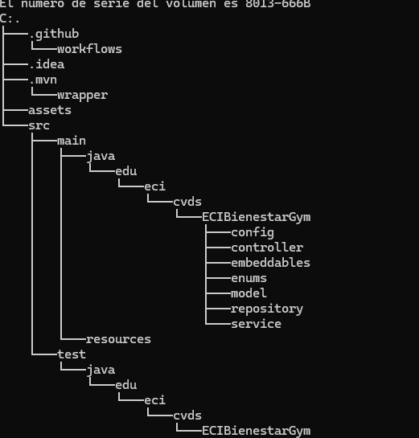

# ECIBienestarGym
BackEnd del componente de Gimnasio del proyecto ECIBienestar

### Tecnologias

Lenguaje: Java 17

Construcción: Apache Maven 3.9.x.

Framework: SpringBoot 3.3.4.

Despliegue: AzureDevops.

Base de Datos: MongoDB.

### Módulo de Gestión de Gimnasio

Este módulo permite a los estudiantes reservar sesiones de entrenamiento, diseñar sus rutinas personalizadas y realizar un seguimiento detallado de su progreso físico.

Con el acompañamiento de un profesor, los usuarios reciben comentarios sobre su evolución, obtienen recomendaciones adaptadas a sus objetivos y acceden a sesiones estructuradas según sus necesidades. 

Además, los entrenadores pueden generar reportes de desempeño individuales y grupales, así como reportes sobre sesiones, gestionar rutinas y optimizar la experiencia de entrenamiento.

### Funcion del modulo

Para la funcionalidad del modulo estamos usando el patron de diseño de Modelo Vista Controlador,
usamos el modulo 6 de gestion de usuarios para manejar que funciones tiene el rol de administrador, entrenador y de 
estudiantes.

### Diagrama de datos:

### Diagrama de clases

### Diagrama de componentes

### Funcionalidades

Las funcionalidades estan repartidos en difentes controladores con sus 
respectivos endpoints.

## Endpoints expuestos:

### GymSessionController:

| **Endpoint** | **Descripción** | **Entrada** | **Salida** |
|:-------------|:----------------|:------------|:-----------|
| `GET /getAllGymSessions` | Obtener todas las sesiones del gimnasio | - | Todas las sesiones |
| `GET /getGymSessionsById` | Obtener la sesión según su ID | id | Sesión correspondiente |
| `GET /getGymSessionByCoachId` | Obtener sesiones según el coach | coach | Sesiones del coach |
| `GET /getGymSessionByCapacity` | Obtener sesiones según capacidad | capacity | Sesiones filtradas por capacidad |
| `GET /getGymSessionsBySchedule` | Obtener sesiones según fecha | schedule | Sesiones en esa fecha |

### PhysicalProgressControler:

| **Endpoint** | **Descripción** | **Entrada** | **Salida** |
|:-------------|:----------------|:------------|:-----------|
| `GET /getAllPhysicalProgress` | Obtener todos los progresos físicos | - | Todos los progresos |
| `GET /getPhysicalProgressById` | Obtener progreso por ID | id | Progreso correspondiente |
| `GET /getPhysicalProgressByUserId` | Obtener progreso según usuario | user | Progresos del usuario |
| `GET /getPhysicalProgressByRegistrationDate` | Obtener progresos por fecha | date | Progresos según fecha |

### ReportController:

| **Endpoint** | **Descripción** | **Entrada** | **Salida** |
|:-------------|:----------------|:------------|:-----------|
| `GET /getAllReport` | Obtener todos los reportes | - | Todos los reportes |
| `GET /getReportById` | Obtener reporte por ID | id | Reporte correspondiente |
| `GET /getReportsByCoach` | Obtener reportes por coach | coach | Reportes del coach |
| `GET /getReportsByGeneratedAt` | Obtener reportes por fecha | date | Reportes según fecha |
| `GET /getReportsByType` | Obtener reportes por tipo | type | Reportes según tipo |

### ReservationController:

| **Endpoint** | **Descripción** | **Entrada** | **Salida** |
|:-------------|:----------------|:------------|:-----------|
| `GET /getAllReservations` | Obtener todas las reservas | - | Todas las reservas |
| `GET /getReservationById` | Obtener reserva por ID | id | Reserva correspondiente |
| `GET /getReservationsByUserId` | Obtener reservas por usuario | userId | Reservas del usuario |
| `GET /getReservationsByGymSession` | Obtener reservas por sesión de gimnasio | gymSession | Reservas de la sesión |
| `GET /getReservationsByReservationDate` | Obtener reservas por fecha | reservationDate | Reservas según fecha |
| `GET /getReservationsByState` | Obtener reservas por estado | status | Reservas según estado |

### RoutineController:

| **Endpoint** | **Descripción** | **Entrada** | **Salida** |
|:-------------|:----------------|:------------|:-----------|
| `GET /getAllRoutines` | Obtener todas las rutinas | - | Todas las rutinas |
| `GET /getRoutineById` | Obtener rutina por ID | id | Rutina correspondiente |
| `GET /getRoutinesByName` | Obtener rutina por nombre | name | Rutina según nombre |
| `GET /getRoutinesByDifficulty` | Obtener rutinas por dificultad | level | Rutinas según dificultad |
| `GET /getRoutinesByExercises` | Obtener rutinas que contengan un ejercicio | exercises | Rutinas con ejercicio |

### UserController:
| **Endpoint** | **Descripción** | **Entrada** | **Salida** |
|:-------------|:----------------|:------------|:-----------|
| `GET /getAllUsers` | Obtener todos los usuarios | - | Todos los usuarios |
| `GET /getUsersByName` | Obtener usuario por nombre | name | Usuario según nombre |
| `GET /getUsersByEmail` | Obtener usuario por email | email | Usuario según email |
| `GET /getUsersByRole` | Obtener usuario por rol | role | Usuarios según rol |
| `GET /getUsersByRegistrationDate` | Obtener usuario por fecha de registro | date | Usuarios según fecha |

### Estructura del proyecto

 
## Como ejecutar el proyecto

1: Clonar repositorio

git clone https://github.com/ECIBienestar/netherita-gymnasium-service.git

cd ECIBienestar

2 Correr poryecto con mvn 

mvn clean install

3: Iniciar el back:

Ir a EciBienestarGymApplication

Colocar en el terminal mvn spring-boot:run

### Link expuesto en azure:

http://netherita-gymnasium-service-d8hvgjameybudsh3.canadacentral-01.azurewebsites.net/

